<div align="center">

# HDASH

**The household, on one screen.**

A self-hosted dashboard for people who share a home: chores, groceries, todos,
the calendar, the money, and a straight answer to *"are we even?"*

`Next.js 16` · `React 19` · `ASP.NET Core 9` · `EF Core` · `SQLite` · `Docker`


<sub>▶ <a href="docs/demo.mp4">Full-quality video (MP4, 1 min)</a></sub>

</div>

---

## Why

Most household apps are a shared calendar and a shopping list. Living with someone
involves two other running tallies: **who's paying for what**, and **who's doing the work**.
Splitwise tracks the first. Nothing tracks the second. HDASH does both, in the same place
as the rest of your day.

It's built to run on a €4 VPS or a Raspberry Pi: one SQLite file, one `docker compose up`,
and no third-party accounts.

## Try it in 60 seconds

```bash
git clone https://github.com/JesusEgonVenegas/hdash.git && cd hdash
cp .env.example .env
sed -i "s/^JWT_KEY=.*/JWT_KEY=$(openssl rand -hex 32)/" .env
echo "DEMO_SEED=true" >> .env
docker compose up -d --build
```

Open **http://localhost:3000** and sign in as `admin@hdash.local` / `admin123`.
You'll land in **The Nest**, a demo two-person household with a few weeks of chores,
expenses, debts, meals and notes already in it.

---

## A tour

### Today and the dashboard

Everything that needs you, sorted by urgency: overdue chores, todos due today, today's
events, debt payments coming up. The nav badge shows the count, so you can tell at a
glance whether anything is waiting.

<p align="center">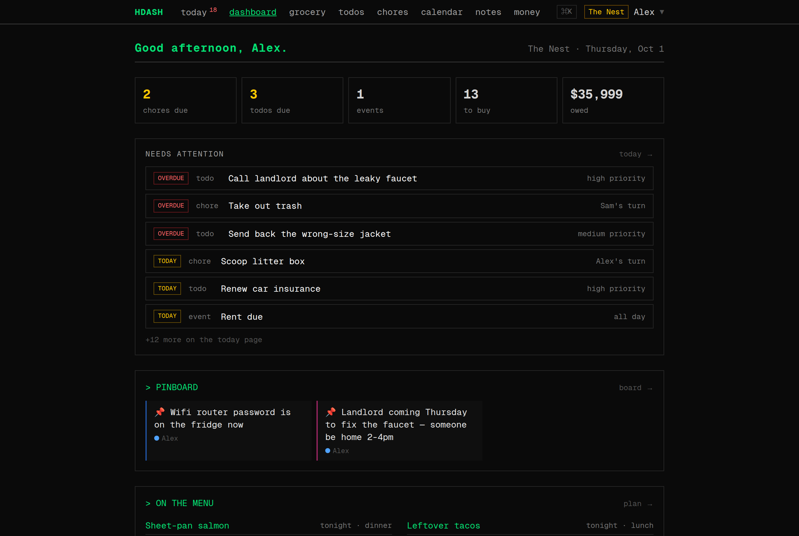</p>

### Chores that rotate themselves

Chores have a frequency and an owner. Tick one off and it passes to **the next person
after whoever did it**, so covering someone's turn doesn't hand the chore straight back
to you. On-time completions build a 🔥 streak. Tapped it by mistake? Undo restores the
assignee, due date and streak exactly as they were.

<p align="center">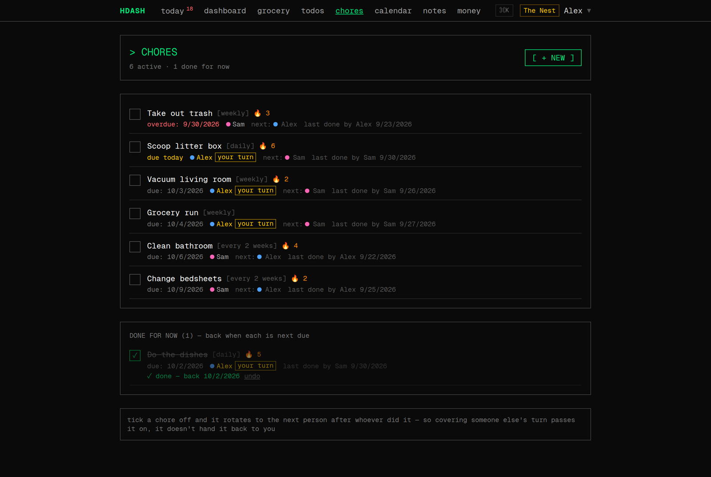</p>

### The Fairness Ledger: are we even?

One page combines both tallies. **Money carried** compares what each person paid with
their fair share of shared expenses (split equally or by income). **Chore load** counts
who actually did the work. You get a single verdict in plain English:

> *Alex covers more of the costs; Sam does more of the chores, so you're splitting the load.*

It covers a rolling 30 days, so it doesn't reset to empty on the 1st of the month.

<p align="center">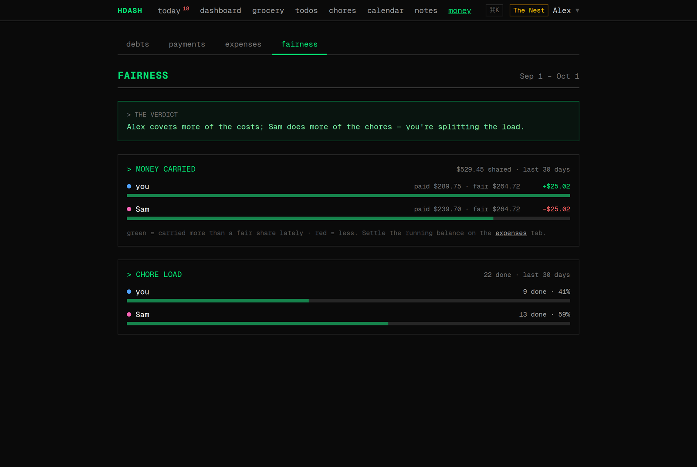</p>

### Money

- **Shared expenses** with categories, a monthly breakdown, recurring bills (rent, internet),
  and settle-up that tells you who owes whom.
- **Proportional splitting:** set each person's income and shared costs divide by earnings
  instead of per head.
- **Debts with real interest.** Balances accrue monthly interest on the server, so the number
  you see is what you actually owe, not principal minus payments.
- **Payoff simulator.** Enter a monthly budget and compare avalanche and snowball: debt-free
  date, total interest, payoff order, and the balance month by month.

<table>
<tr>
<td>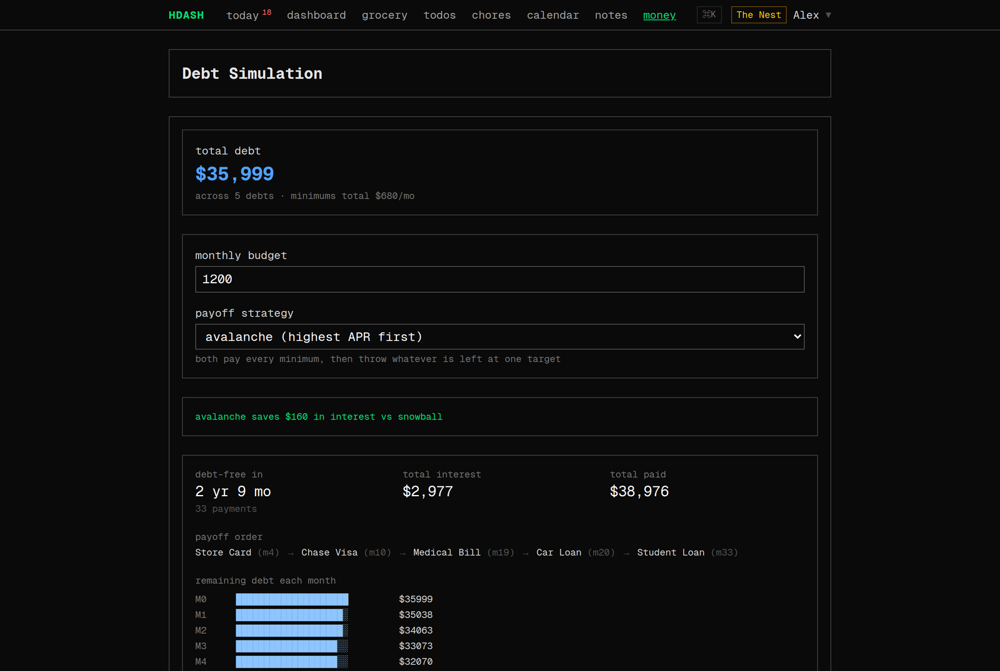</td>
<td>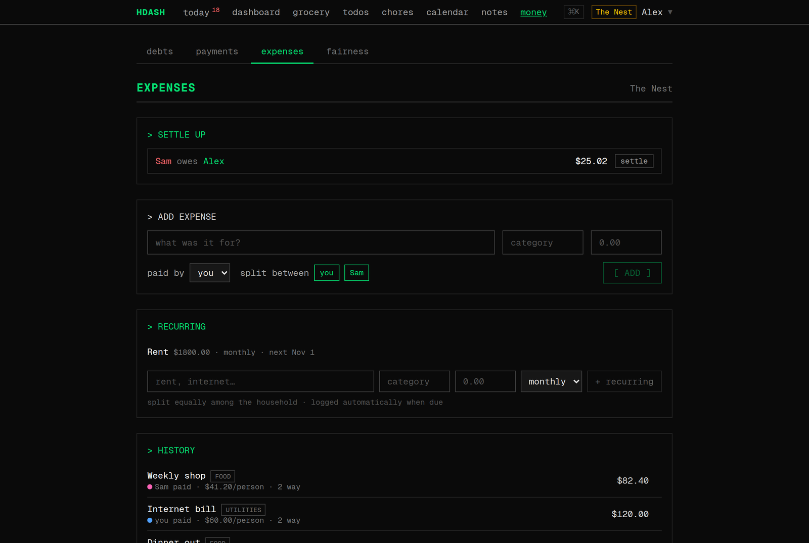</td>
</tr>
</table>

### The rest of the house

<table>
<tr>
<td width="50%"><b>Grocery</b>: grouped by aisle, quick-add staples, check off as you shop.<br>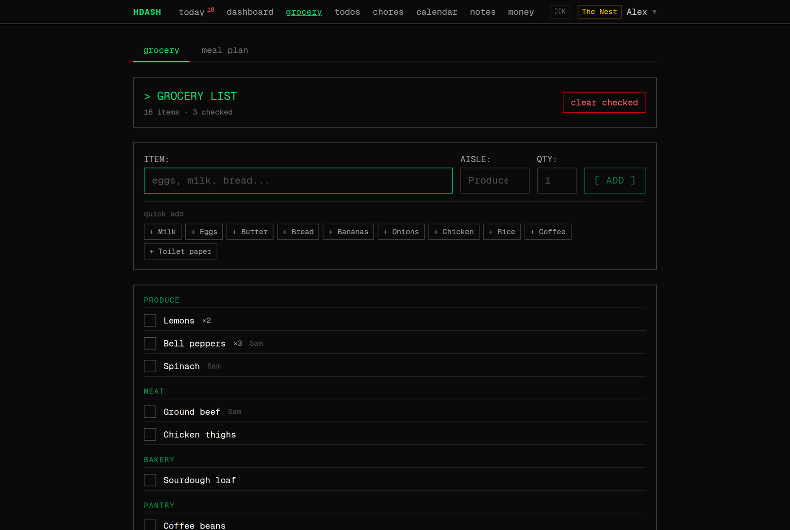</td>
<td width="50%"><b>Meal plan</b>: plan the week, then push the ingredients to the shopping list.<br>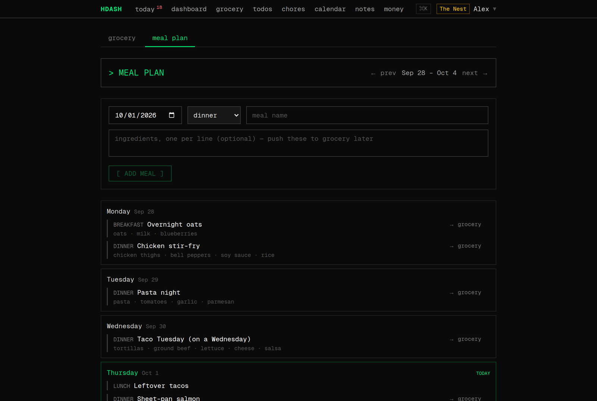</td>
</tr>
<tr>
<td><b>Calendar</b>: month view with recurring events.<br>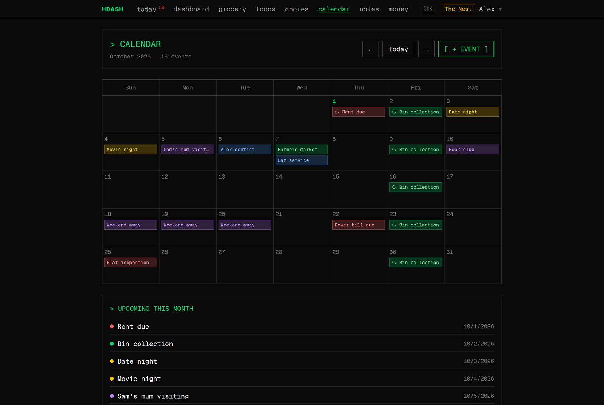</td>
<td><b>Pinboard</b>: shared notes, pinned ones surface on the dashboard and in the digest.<br>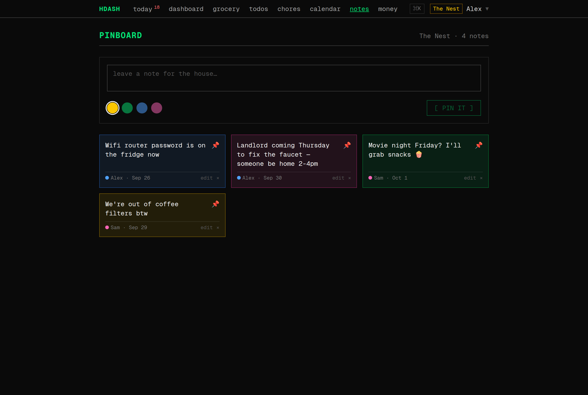</td>
</tr>
</table>

Also: recurring **todos** with priorities and assignment, per-member **colors** for
attribution, and **web push** notifications ("your turn 🧹", "you got paid 💸").

### Keyboard-first

<kbd>⌘</kbd>/<kbd>Ctrl</kbd> + <kbd>K</kbd> opens a command palette that jumps to any
page or runs a quick action (add a grocery item, post a note).

<p align="center">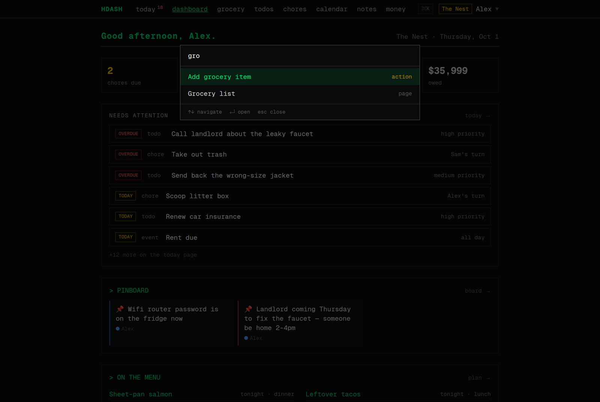</p>

### Nine themes

The default look is a green-on-black terminal. Settings has a live theme picker with
**Gruvbox, Solarized, Dracula and Nord** (light and dark where they exist), plus two
**Bauhaus** themes in Jost with solid color blocks. The theme applies instantly and loads
without a flash of the wrong one.

<p align="center">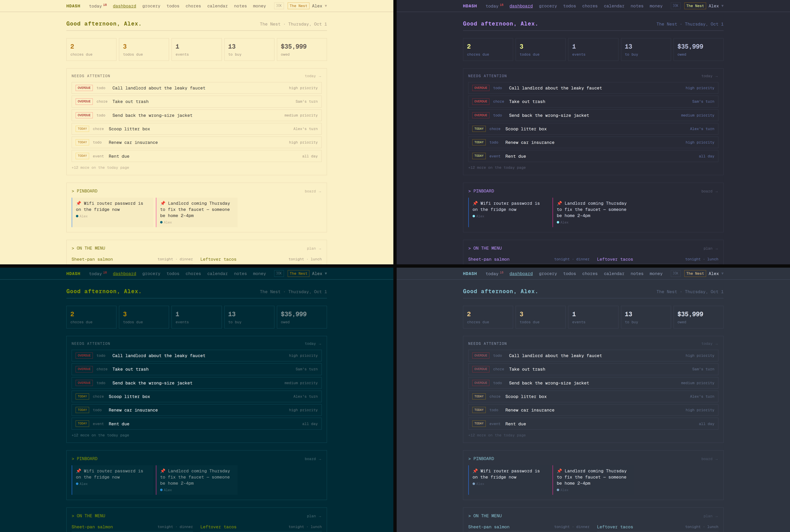</p>

### Works on your phone

<p align="center">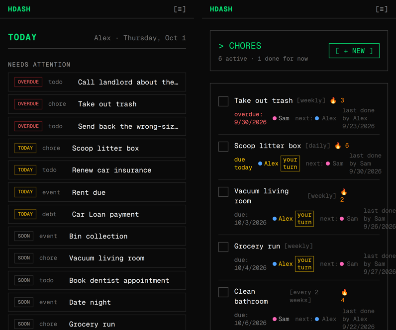</p>

### A morning email

Once a day, each person can get the household's day by email. There are four
interchangeable skins: **Departures** (a transit board where overdue items are `DELAYED`),
**Terminal** (a CI build log, `BUILD FAILING — 3 task(s) overdue`), **Herald** (a newspaper
broadsheet) and a plain baseline. `auto` sends Herald on Sundays and your weekday skin
the rest of the week.

<p align="center">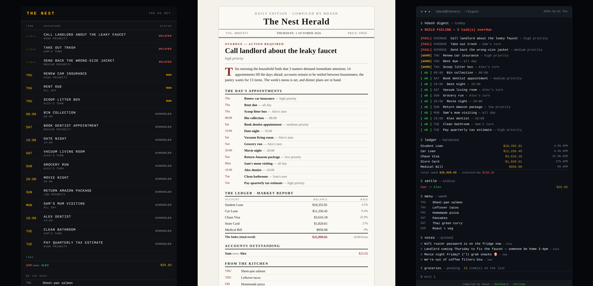</p>

---

## Tech stack

| Layer | Tech |
|---|---|
| Frontend | Next.js 16 (App Router), React 19, Tailwind CSS 4, TypeScript |
| Backend | ASP.NET Core 9 minimal APIs, Entity Framework Core |
| Database | SQLite: one file, automatic migrations, scheduled `VACUUM INTO` backups |
| Auth | ASP.NET Identity + JWT, email verification, password reset, rate-limited login, server-side revocation |
| Email | Pluggable `IEmailSender`: dev file outbox or any SMTP server |
| Push | Web Push (VAPID). Keys are generated and saved on first run |
| Deploy | `docker compose`: two containers and one data volume |

## Local development

**Prerequisites:** [.NET 9 SDK](https://dotnet.microsoft.com/download/dotnet/9.0) · [Node.js 20+](https://nodejs.org/)

**Backend.** Create `backend/appsettings.Development.json` (gitignored):

```json
{ "Jwt": { "Key": "your-secret-key-at-least-32-characters-long!!" } }
```

```bash
cd backend
dotnet run                       # → http://localhost:5063, migrations apply on start
Seed__Reset=true dotnet run      # rebuild the demo household against today's date
```

The demo household seeds automatically in Development. Its dates are relative to when it
was seeded, so after a few weeks everything looks overdue. `Seed__Reset=true` rebuilds
it and leaves other accounts untouched.

**Frontend.**

```bash
cd frontend
npm install
npm run dev                      # → http://localhost:3000 (any port works in dev)
```

**Tests.**

```bash
dotnet test backend.Tests        # debt math, interest accrual, household rules
```

In development, outgoing email (verification, password reset, digests) is written to
`backend/outbox/` as `.html` files instead of being sent.

## Self-hosting

```bash
cp .env.example .env             # set JWT_KEY at minimum: openssl rand -hex 32
docker compose up -d --build
```

The frontend runs on `:3000` and the backend on `:5063`. The database, backups and VAPID
keys live on the `hdash-data` volume, so they survive rebuilds.

| Variable | What it does |
|---|---|
| `JWT_KEY` | **Required.** Signing secret, ≥32 chars |
| `NEXT_PUBLIC_API_URL` | Backend URL as seen by the browser. Baked in at build time, so rebuild if it changes |
| `FRONTEND_ORIGIN` | Frontend origin, used for CORS and links in emails |
| `DEMO_SEED` | Seed the demo household on first start |
| `DIGEST_ENABLED` / `DIGEST_SKIN` | Daily email digest and its skin (`departures`, `terminal`, `herald`, `baseline`, `auto`) |
| `EMAIL_PROVIDER` / `SMTP_*` | Real email. Any SMTP server works (Gmail app password, Fastmail, Resend, Postmark) |
| `BACKUP_ENABLED` | Nightly SQLite snapshots with rotation |

> **On a remote host:** put Caddy or nginx in front, route `/` to the frontend and the API
> to the backend, and set `NEXT_PUBLIC_API_URL` to the public URL before building.
> Push notifications need HTTPS (or `localhost`).

## Engineering notes

- **Debt math lives on the server.** `DebtCalculator` is the single, unit-tested source of
  truth for balances with accrued interest. Clients never recompute it.
- **One rule for household scoping.** `HouseholdScope` decides who can see what once,
  instead of repeating that check in every endpoint.
- **Chore history is an append-only log.** Each completion records who did it and a
  snapshot of the chore's previous state. The Fairness Ledger is built from that log,
  and undo restores from the snapshot.
- **Skin-swappable digest.** `DigestService` assembles a skin-agnostic `HouseholdDigest`.
  Each look is one `IDigestRenderer`: table layout with inline CSS, so it renders in
  Gmail and Outlook.
- **Themes are CSS variables.** Each theme overrides Tailwind 4's color variables under
  `html[data-theme]`, so every component re-skins without per-component changes.

## Project structure

```
hdash/
├── backend/
│   ├── Endpoints/    # minimal API groups: auth, chores, fairness, digest, push, …
│   ├── Services/     # DebtCalculator, HouseholdScope, Digest/, Email/, Push/, backups
│   ├── Models/       # EF entities
│   ├── Data/         # DbContext + demo seeder
│   └── Migrations/
├── backend.Tests/    # xUnit
├── frontend/src/
│   ├── app/          # one folder per page + shared components
│   ├── lib/          # API client, auth, themes, push, debt math
│   └── types/
├── docs/             # screenshots + demo video
└── docker-compose.yml
```

## Roadmap

- [x] Email verification, password reset, login rate-limiting, token revocation
- [x] Automated backups, Docker deploy
- [x] Fairness Ledger, proportional splitting, chore streaks and undo
- [x] Web push, daily digest with four skins, nine UI themes
- [ ] Installable PWA (offline grocery list)
- [ ] Insights ("grocery spend up 30% this month")
- [ ] Calendar sync (ICS export/subscribe)

---

<div align="center"><sub>Built for the people you live with.</sub></div>
